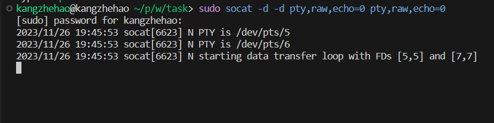
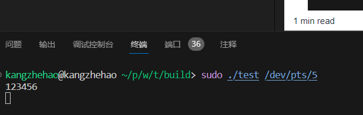
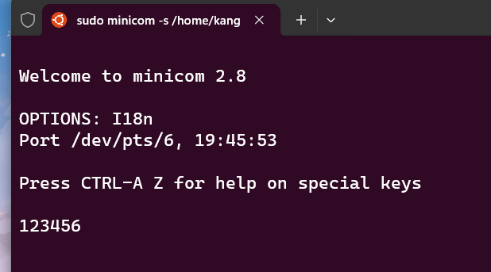
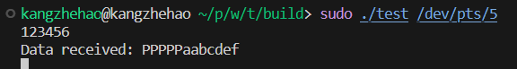
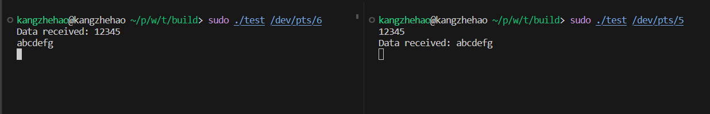

#### 串口任务
* 设计了一个Serial类，该类使用boost::asio库与串口通信。在main函数中，创建了两个线程，一个用于发送数据，另一个用于接收数据。发送线程从stdin读取输入并将其发送到串口，接收线程从串口读取数据并将其打印到stdout。数据包用回车符号"\n"分割
* 实验环境在wsl2下，使用socat创造虚拟串口，使用minicom软件调试串口通信功能。
#### 实验效果：
创造虚拟串口对`/dev/pts/5`和 `/dev/pts/6`：

1. 程序与minicom调试软件通信效果：

运行代码，传入参数指定连接串口`/dev/pts/5`，并通过发送线程向其发送数据

可以看到minicom软件调试的虚拟串口成功收到数据

接收线程也可以同时接收到数据

2. 程序之间通信效果：

可以看到任一个程序进程的发送线程可以给另一个程序的接收线程正确发送数据并被正确接收